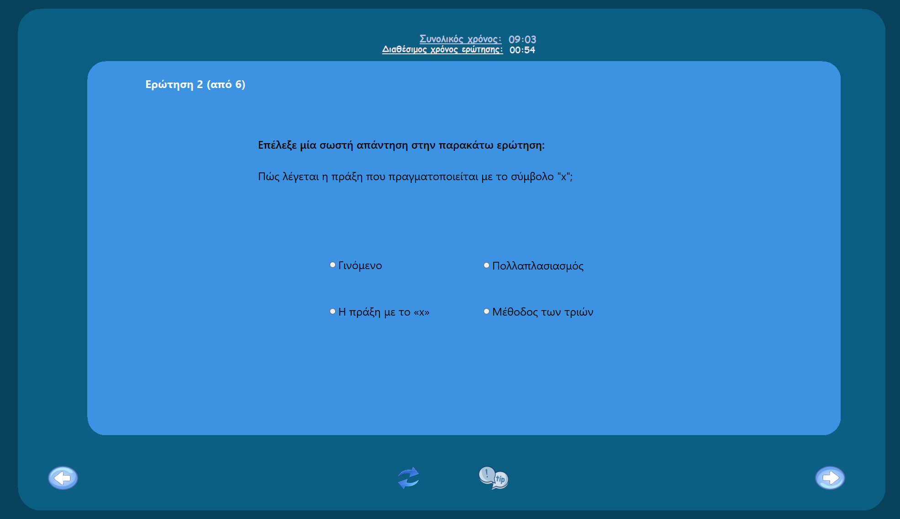
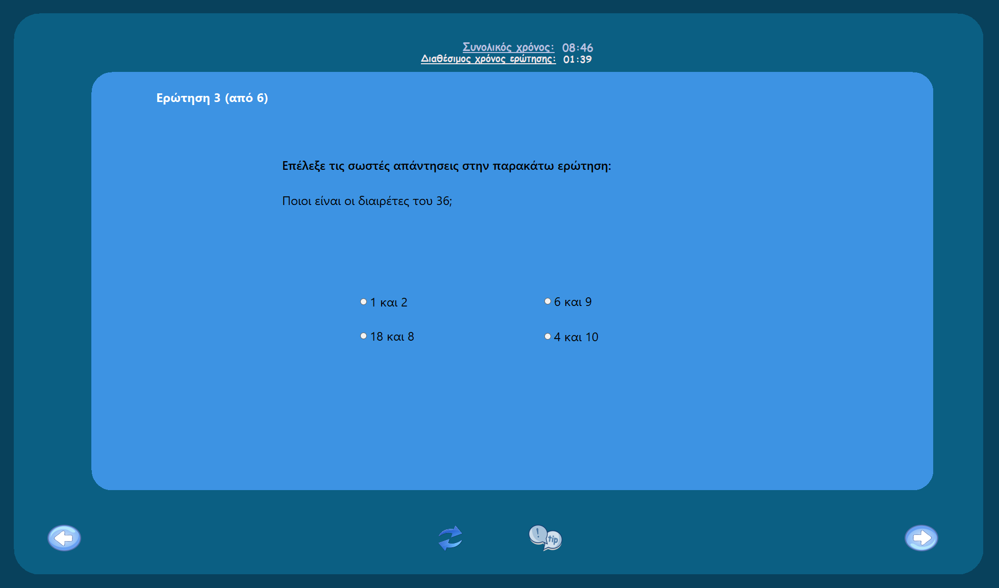
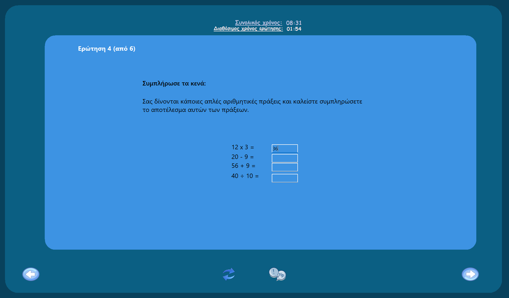
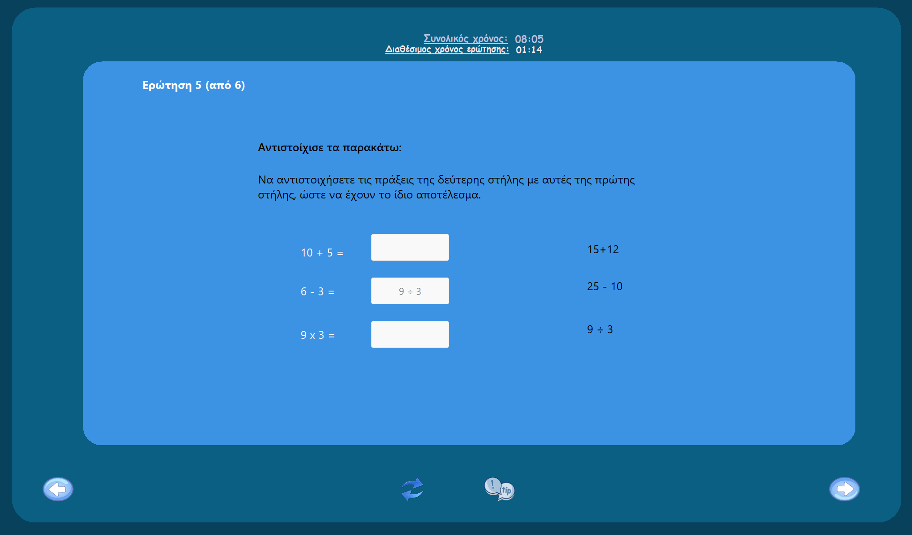
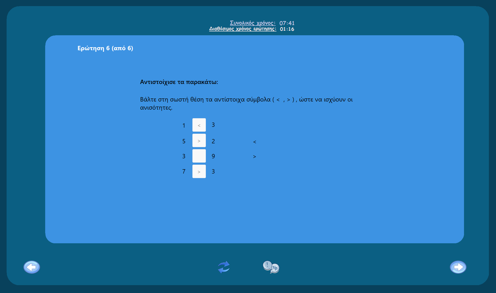
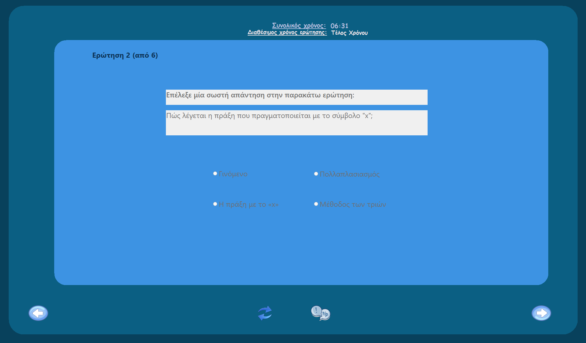
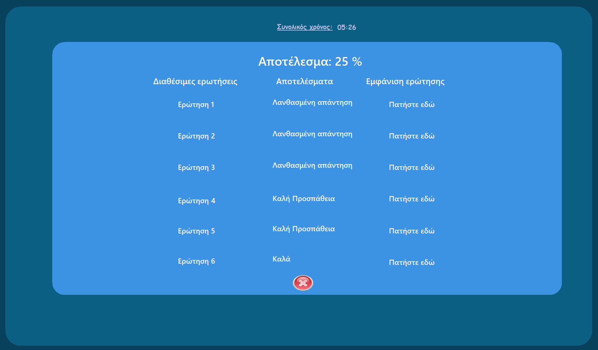
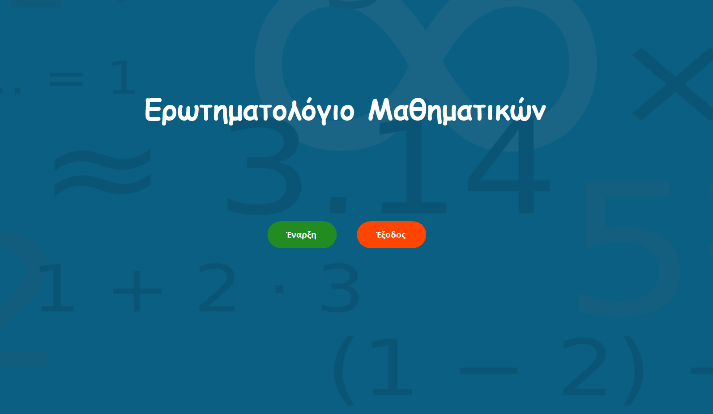
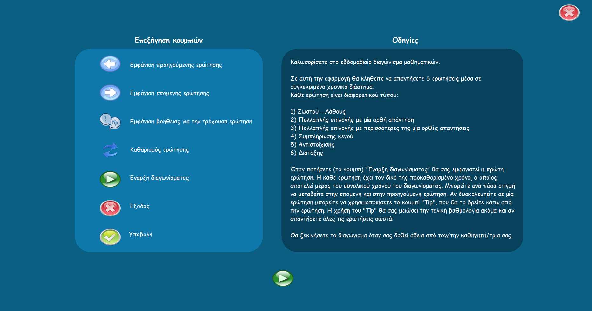
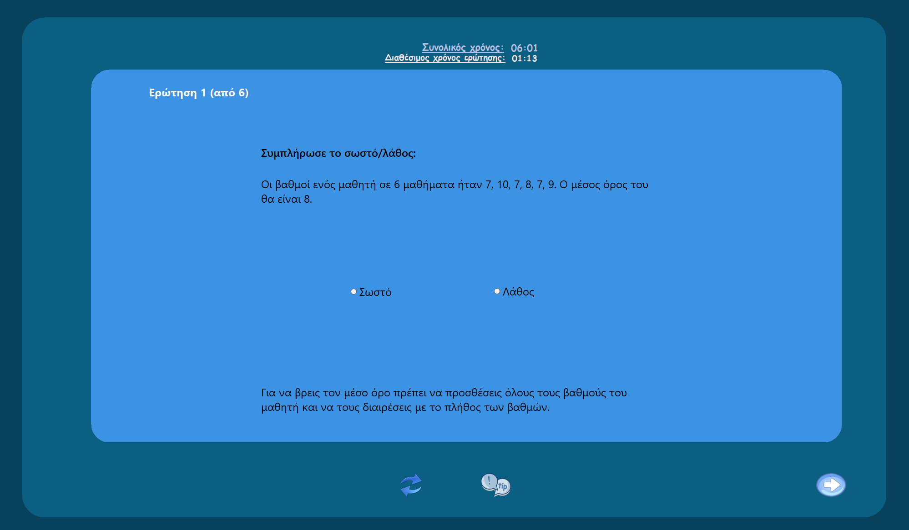

# Learning Management Software Project (2022) - Educational Quiz App

## Project Overview
This project is a team assignment for the "Learning Management Software Project" course, offered in the 5th semester of the 2022 academic year at the University of Piraeus, Department of Informatics. The project is an implementation of an educational quiz app, developed using C#. The software is designed to handle various types of closed-ended questions for a selected educational subject. The application presents a randomly selected set of questions to the user, enforces time limits for each question, and automatically evaluates the user's performance.

## Course Information
- **Institution:** [University of Piraeus](https://www.unipi.gr/en/)
- **Department:** [Department of Informatics](https://cs.unipi.gr/en/)
- **BSc course:** Learning Management Software Project (2022)
- **Semester:** 5th

## Technologies Used
- Visual C#
- XAML
- Windows Presentation Foundation (WPF)

## Features
- **Question Types Supported**:
  - **True/False**: Select whether a statement is true or false.
    
  - **Single-Choice Multiple Selection**: Choose one correct answer from multiple options.
     
  - **Multiple-Choice Multiple Selection**: Select all correct answers from a set of options.
    
  - **Fill in the Blank**: Complete a sentence by filling in the blank(s).
    
  - **Matching**: Match pairs of related items using drag-and-drop functionality.
    
  - **Ordering**: Arrange items in the correct order using drag-and-drop functionality.
    

- **Random Question Selection**: 
  - The software randomly selects and presents 6 questions from the available pool of at least 18 questions.

- **Time Management**:
  - Each question has a maximum time limit, which is displayed to the user with a countdown timer.
  - When the time expires, the question is locked, meaning the user can no longer edit their answer but can still view the question.
    

- **Answer Submission**:
  - The user can submit their answers manually by clicking the submit button or automatically upon time expiration.

- **Performance Evaluation**:
  - The software evaluates the user's responses and calculates a final score expressed as a percentage.
    

- **Overall Time Display**: 
  - Displays the total remaining time for completing all questions.

- **Detailed Evaluation Report**:
  - After submission, the software provides a detailed report, showing the 6 questions presented, the user’s answers, and the correct answers if different.

## Additional Screens
- **Main Menu**: The starting point for the user to begin the quiz.
  
  
- **Instructions**: Instructions provided to the user on how to use the app.
  
  
- **Hint System**: In multiple-choice questions, a hint system that can remove an incorrect option.
  

## Usage
- Upon starting the application, the user will be presented with a series of 6 randomly selected questions.
- The user must answer each question within the allotted time.
- Once all questions are answered or the total time expires, the user can submit the quiz answers for evaluation.
- After submission, a detailed performance report is generated.

## Installation and Setup
1. Install **Visual Studio Enterprise 2022**.
2. Open the solution file in Visual Studio.
3. Build the solution to restore NuGet packages and compile the project.
4. Execute the main program by running the project within Visual Studio.

## Contributors
<table>
  <tr>
    <td align="center"><a href="https://github.com/thkox"> <b>Theodoros Koxanoglou</b></a> </td>
    <td align="center"><a href="https://github.com/dimitrisstyl7"> <b>Dimitris Stylianou</b></a> </td>
    <td align="center"><a href="https://github.com/IamInloveWitheCode"> <b>Sotiris Chatzikyriakou</b></a> </td>
    <td align="center"><a href="https://github.com/panagiota02"> <b>Panagiota Nicolaou</b></a> </td>
    <td align="center"><a href="https://github.com/PetsasBros"> <b>Rafailia Karapetsa-Lazaridou</b></a> </td>
  </tr>
</table>

## Acknowledgments
This project was developed as part of the "Learning Management Software Project" BSc course at the University of Piraeus. Contributions and feedback are always welcome!

## License
This project is licensed under the MIT License - see the [LICENSE](./LICENSE) file for details.
